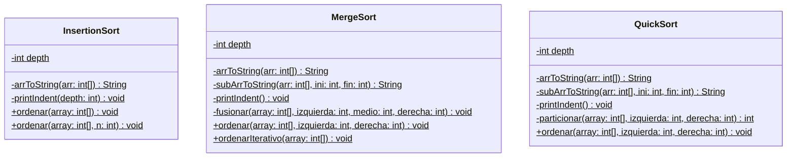

# Modelos UML

Esta carpeta contiene el código fuente del diagrama de clases en formato PlantUML (`Algoritmos_Ordenacion.puml`).

Como GitHub no renderiza directamente los archivos `.puml`, a continuación se incluye el mismo diagrama en formato **Mermaid**, el cual se visualiza automáticamente aquí:

