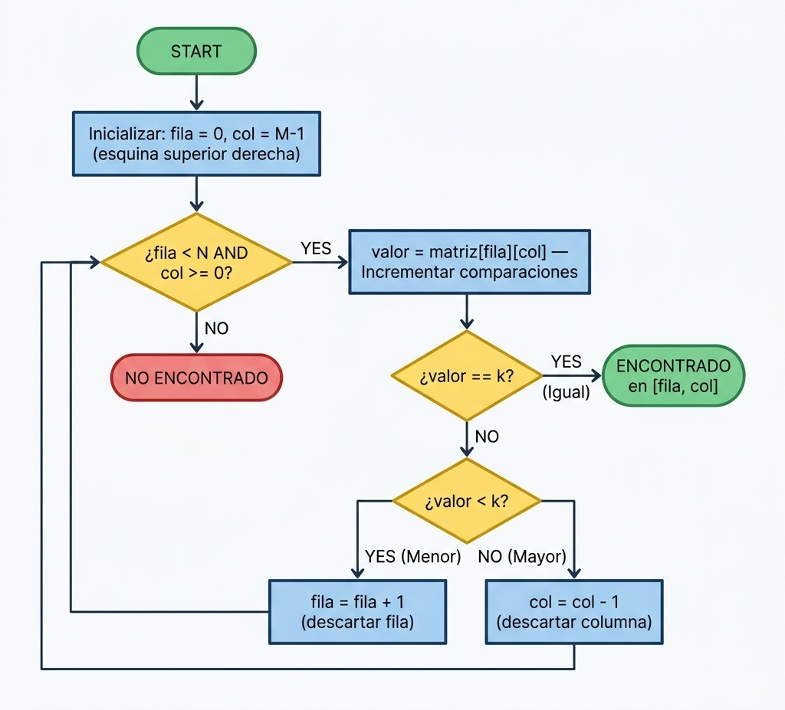

# Búsqueda Óptima en Matriz Ordenada

## 1. El Problema

Dada la siguiente matriz 5×5, donde los valores son **estrictamente crecientes por filas y por columnas**:

```
  2   5   9  14  21
  4   7  11  17  25
  8  12  15  20  30
 13  18  22  27  35
 19  24  28  33  40
```

**¿Existe el valor `k = 22`? ¿Con el mínimo número de comparaciones posible?**

---

## 2. Razonamiento Previo

La matriz tiene un invariante de orden: crece de forma estricta tanto hacia la derecha (→) como hacia abajo (↓). Este conocimiento previo es el activo que hay que explotar antes de escribir ni una línea de código.

| Estrategia | Coste | Motivo del descarte |
|---|---|---|
| Búsqueda lineal | O(N·M) | Ignora completamente el orden |
| Búsqueda binaria 1D | — | Solo funciona en espacios unidimensionales |
| **Busqueda por eliminación** | **O(N+M)** | ✅ Explota el orden bidimensional |

---

## 3. Algoritmo: Búsqueda por Eliminación

La idea central es empezar desde la esquina superior derecha (fila 0, columna M−1) y, en cada paso, descartar una fila entera o una columna entera:

| Condición | Movimiento | Por qué es seguro |
|---|---|---|
| `valor == k` | ✅ Encontrado | — |
| `valor < k` | Bajar una fila (`fila + 1`) | Todo lo que queda a la izquierda de esa fila es incluso menor que `valor`, así que `k` no puede estar en ella |
| `valor > k` | Ir a la izquierda (`col − 1`) | Todo lo que hay debajo de esa columna es incluso mayor que `valor`, así que `k` no puede estar en ella |

### Diagrama de flujo



### Traza de ejecución para `k = 22`

| Paso | Celda | Valor | Decisión |
|:---:|---|:---:|---|
| 1 | (F0, C4) | 21 | 21 < 22 → **bajar** |
| 2 | (F1, C4) | 25 | 25 > 22 → **izquierda** |
| 3 | (F1, C3) | 17 | 17 < 22 → **bajar** |
| 4 | (F2, C3) | 20 | 20 < 22 → **bajar** |
| 5 | (F3, C3) | 27 | 27 > 22 → **izquierda** |
| 6 | (F3, C2) | 22 | 22 == 22 → ✅ **¡Encontrado!** |

**6 comparaciones** para localizar el elemento.

---

## 4. Análisis de Complejidad

Para una matriz de tamaño N × M, el algoritmo recorre como máximo la frontera superior-derecha → inferior-izquierda:

| Caso | Situación | Comparaciones | Complejidad |
|---|---|:---:|---|
| **Mejor** | `k` está en la esquina de inicio (valor 21) | **1** | O(1) |
| **Peor** | `k` está en la esquina opuesta o no existe | **N + M − 1** | O(N + M) |

Para esta matriz 5×5: peor caso = 5 + 5 − 1 = **9 comparaciones**.

### Traza del peor caso: `k = 19`

El valor **19** existe en la matriz, ocupa la **esquina inferior izquierda** (F4, C0) — la posición diagonalmente opuesta al punto de inicio. El algoritmo debe recorrer toda la frontera antes de encontrarlo.

| Paso | Celda | Valor | Decisión |
|:---:|---|:---:|---|
| 1 | (F0, C4) | 21 | 21 > 19 → **izquierda** |
| 2 | (F0, C3) | 14 | 14 < 19 → **bajar** |
| 3 | (F1, C3) | 17 | 17 < 19 → **bajar** |
| 4 | (F2, C3) | 20 | 20 > 19 → **izquierda** |
| 5 | (F2, C2) | 15 | 15 < 19 → **bajar** |
| 6 | (F3, C2) | 22 | 22 > 19 → **izquierda** |
| 7 | (F3, C1) | 18 | 18 < 19 → **bajar** |
| 8 | (F4, C1) | 24 | 24 > 19 → **izquierda** |
| 9 | (F4, C0) | 19 | 19 == 19 → ✅ **¡Encontrado!** |

**9 comparaciones**: confirma empíricamente el peor caso teórico N + M − 1.

---

## 5. ¿Existe algún algoritmo con menos comparaciones en el peor caso?

**No.** La búsqueda por eliminación es óptima: ninguna estrategia correcta puede garantizar menos de N + M − 1 comparaciones en el peor caso.

### Demostración por cota inferior (argumento del adversario)

Consideremos la anti-diagonal que conecta la esquina superior-derecha con la inferior-izquierda. Sobre esta matriz 5×5 contiene exactamente **N + M − 1 = 9 posiciones** (marcadas con `·`):

```
  2   5   9  14 [21]
  4   7  11 [17]  25
  8  12 [15]  20  30
 13 [18]  22   27  35
[19]  24  28   33  40
```

Cada una de esas celdas es un candidato válido a contener el valor buscado. Ahora supongamos que el algoritmo hace menos de N + M − 1 = 9 comparaciones. Esto significa que hay al menos una celda de la anti-diagonal que nunca fue visitada. Un adversario podría haber colocado el valor buscado exactamente en esa celda: el algoritmo no la comprobó, por lo que devuelve un resultado incorrecto (falso negativo).

Por tanto, **cualquier algoritmo correcto debe visitar las N + M − 1 celdas de la frontera en el peor caso**, lo que implica Ω(N + M) comparaciones. La búsqueda por eliminación alcanza exactamente ese límite: es óptima.

> La diferencia entre O(N·M) y O(N+M) no es de algoritmo, es de **información**. Y no se puede hacer mejor que O(N+M): el orden bidimensional de la matriz ya está siendo explotado al máximo.

---

## 6. Documentación de Clases

Cada clase Java tiene su responsabilidad bien delimitada. La descripción detallada de atributos, métodos y flujo de ejecución se encuentra en [`docs/documentacion_clases.md`](docs/documentacion_clases.md).

---

## 7. Enfoque Alternativo Analizado

Se estudió también un enfoque basado en **Búsqueda por Cuadrantes** (desde el centro). Aunque algorítmicamente correcto, resulta más costoso que la búsqueda por eliminación. El análisis completo se encuentra en [`docs/analisis_comparativo.md`](docs/analisis_comparativo.md).

---

## 8. Segunda Parte del Reto (2Think²)

Se plantearon tres cuestiones adicionales: prueba del algoritmo con `k = 21` y `k = 16`, y el análisis de si existe algún caso concreto donde empezar del centro sea mejor que empezar de la esquina. La resolución completa se encuentra en [`docs/pruebas_y_analisis.md`](docs/pruebas_y_analisis.md).

---

## 9. Estructura del Proyecto

```
gonzalezMarcos/
├── README.md
├── src/
│   ├── Main.java                        ← punto de entrada
│   ├── MatrizOrdenada.java              ← modelo de datos
│   └── BusquedaPorEliminacion.java      ← algoritmo de búsqueda
├── docs/
│   ├── documentacion_clases.md          ← descripción de atributos y métodos
│   ├── analisis_comparativo.md          ← comparación con Búsqueda por Cuadrantes
│   └── pruebas_y_analisis.md            ← segunda parte del reto
├── modelosUML/
│   └── algoritmo.puml                   ← fuente PlantUML del diagrama de flujo
└── images/
    └── algoritmo_flujo.png              ← diagrama exportado
```

---

## 10. Ejecución

Salida:

```
=== Búsqueda por Eliminación ===

Matriz 5×5:
   2   5   9  14  21
   4   7  11  17  25
   8  12  15  20  30
  13  18  22  27  35
  19  24  28  33  40

Buscando k = 22...
  Paso 1  → (F0, C4) = 21 | 21 < 22 → bajar
  Paso 2  → (F1, C4) = 25 | 25 > 22 → izquierda
  Paso 3  → (F1, C3) = 17 | 17 < 22 → bajar
  Paso 4  → (F2, C3) = 20 | 20 < 22 → bajar
  Paso 5  → (F3, C3) = 27 | 27 > 22 → izquierda
  Paso 6  → (F3, C2) = 22 | ¡Encontrado en (3,2)!

Resultado: ENCONTRADO en posición [3][2] — 6 comparación(es)

--- Análisis de casos para matriz 5×5 ---
Mejor caso (elemento en esquina de inicio):  1 comparación
Peor caso  (N + M - 1 = 5 + 5 - 1): 9 comparaciones
```
